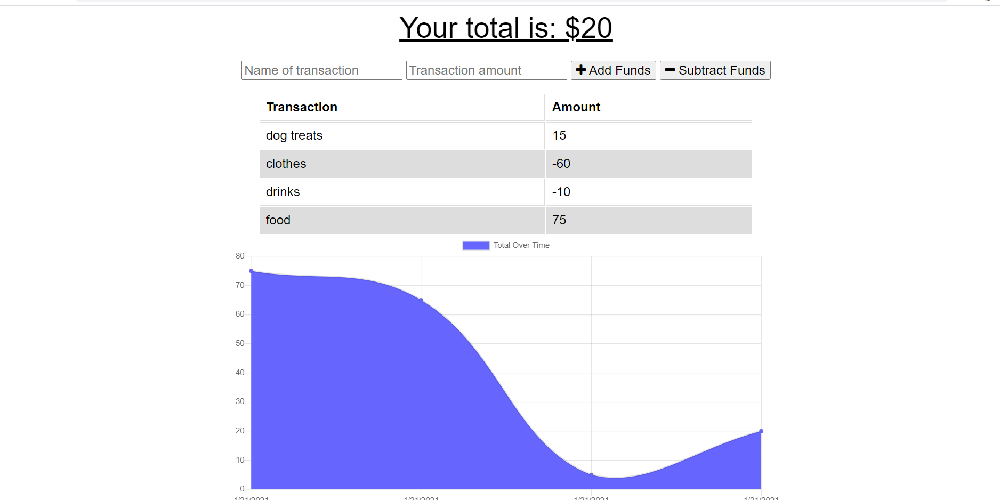

# Budget-Tracker

## Description

This budget tracker is created in order to keep track of expenses. The user can enter the title of the expense, the amount, and then either subtract or add the expense to the total. This application also has the added feature of being able to access offline. The user can add in expenses while offline, and then once online the expenses will be registered in the account. The user also is shown a graph which displays the flow of expenses based over time.

## Images 
  

## Installation
    Node, MONGO, mongoose, express, morgan, compression
## Usage
    For personal use.
## License
    none
## Contributors
    Joanna Grosshans, creator
## Tests
   none
## Questions
jgrossh2  
[GitHub](https://github.com/jgrossh2/budget-tracker)  
[Heroku webpage](https://guarded-caverns-49606.herokuapp.com/)  
Please contact <joannagrosshans2@gmail.com> for additional Information.

# Technologies used
 *JS  
 *NODE  
 *EXPRESS  
 *MONGO  
 *MONGOOSE

 